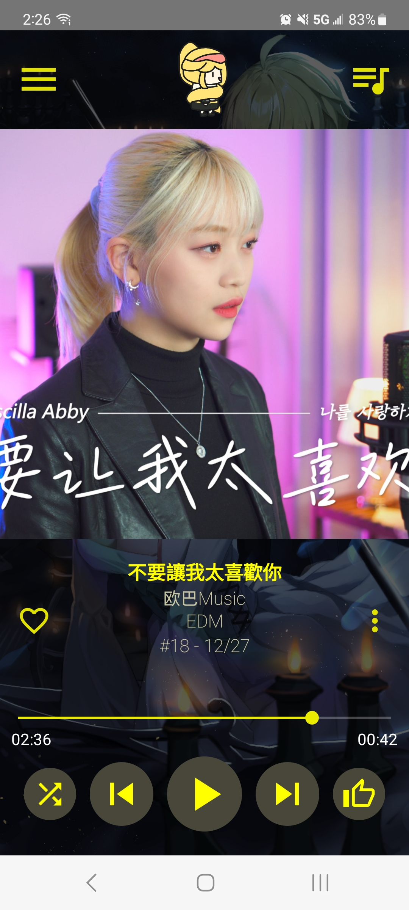
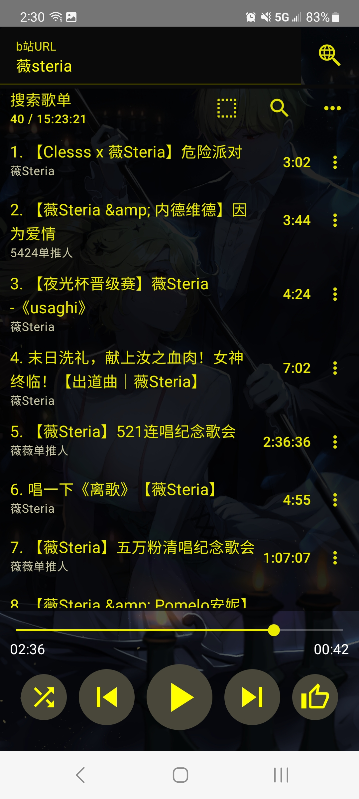
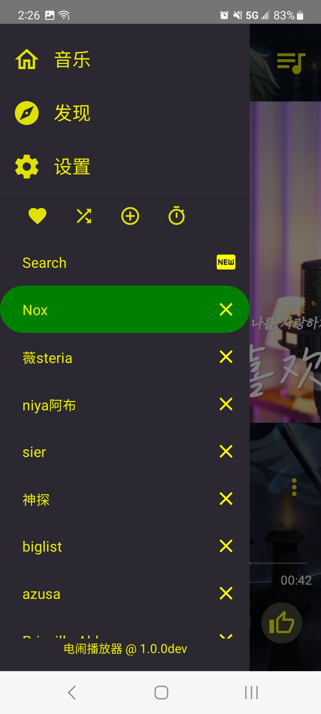
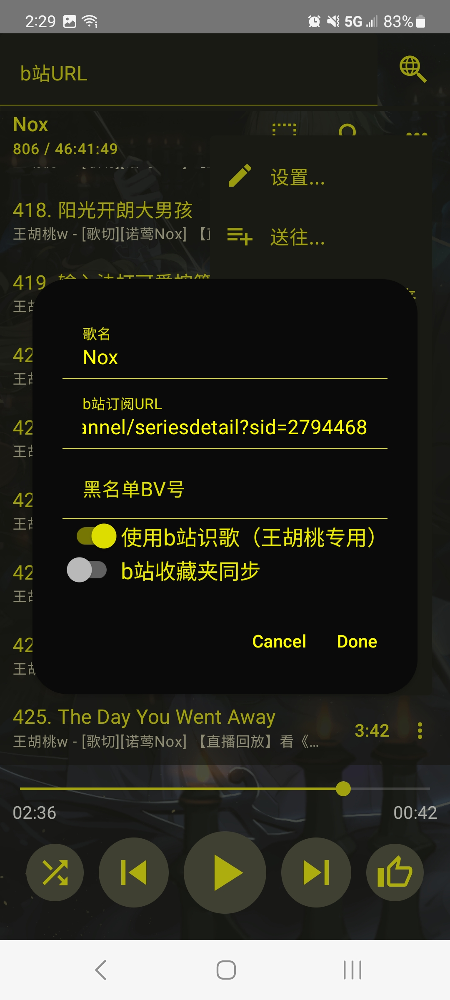
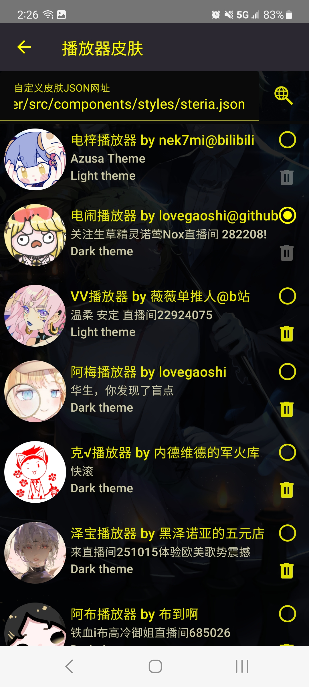

# 电梓播放器的基本使用

电梓播放器手机版是[电梓播放器插件版](https://github.com/kenmingwang/azusa-player)，以及[电闹播放器插件版](https://github.com/lovegaoshi/azusa-player/)的忠实复刻。宣发视频正在制作中。

## 填入 b 站网址进行搜索

右滑进入歌单界面，在最上方的搜索栏填入 b 站网址。支持 bv 号，au 号，收藏夹，视频合集，视频列表，b 站空间，steria.vplayer.tk。

支持的鏈接為：

1. bv/av: https://www.bilibili.com/video/BV1kk4y1b7uE?p=1
2. b 站視頻合集：https://space.bilibili.com/529249/channel/collectiondetail?sid=186394
3. b 站視頻列表：https://space.bilibili.com/3493085134719196/channel/seriesdetail?sid=2939321
4. b 站收藏夾：https://space.bilibili.com/3493085134719196/favlist
5. b 站個人空間：https://space.bilibili.com/529249/video?tid=3&special_type=&pn=1&keyword=&order=pubdate
6. b 站音頻：https://www.bilibili.com/audio/au3680653?type=3
7. b 站音頻空間：https://space.bilibili.com/529249/audio
8. b 站直播：https://live.bilibili.com/282208
9. b 站關注列表：https://space.bilibili.com/3493085134719196/fans/follow
10. steria.vplayer.tk
11. 油管 watch：https://www.youtube.com/watch?v=qMRClp8ltME
12. 油管播放列表：https://www.youtube.com/playlist?list=PL-mVqujjjwGjZu3wli3iOh0FBdSU6tsNO
13. 油管 mix 列表：
14. [MusicFreePlugins](https://github.com/maotoumao/MusicFreePlugins)支持的拓展

## 把搜索的歌新建为歌单

按搜索歌单右边的 new 按钮将搜索的歌新建为一个歌单。

## 为歌单添加订阅网址并刷新

歌单订阅是管人播放器的王牌功能。歌单订阅能让歌单自动加入新的 b 站视频，等同于 aimp 的智能歌单功能。使用场景是订阅歌切 dd 的 b 站账号和视频合集，每天都有新歌听。

如果从搜索歌单新建为一个歌单，搜索的 b 站地址会自动加入到订阅里。

订阅地址在歌单菜单-歌单选项-订阅 url 内。多个订阅地址可以按照半角分号隔开。

## 更换电梓播放器的皮肤

管人皮肤是电梓播放器的王牌功能。在设置-播放器皮肤选择。管人播放器内建电梓播放器（一个亮色+紫色的主题）和电闹播放器（一个暗色+黄色的主题）两个主题，点击搜索按钮可以获取更多从电闹播放器插件版移植来的其他主题。

